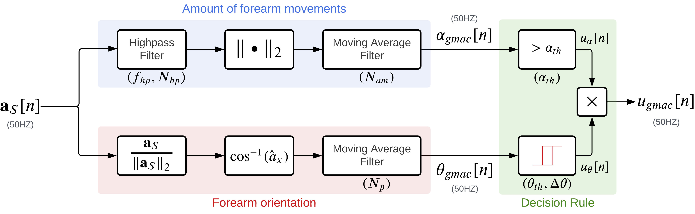

# GMAC: A simple measure to quantify upper limb use from wrist-worn accelerometers

Repository for the analysis of the new GMAC measure for upper-limb use. GMAC stands for "gross movement + acivity counts".

This contains the analysis code employed for the paper "GMAC: A simple measure to quantify upper limb use from wrist-worn accelerometers". The paper is currently under review.

Here is the block diagram of the new GMAC algorithm:

## Getting the data
The data used in this paper can be obtained from our previously opened dataset from the [Upper-Limb Assessment](https://github.com/biorehab/upper-limb-use-assessment) GitHub repository. 

After you clone this repository, carry out the following steps to get the data:
1. Create a folder called `data` in the root directory of this repository.
2. Copy the `control` and `patient` data folders into `data`.

Once you do this you are ready to run the analysis code.

## Analysis Code Details
The analysis has four notebooks:

[01 Pitch Optimization](https://github.com/siva82kb/gmac/blob/main/notebooks/01-pitch_optimization.ipynb): Notebook for optimizing the parameter for the forearm orientation subblock of the new GMAC algorithm.

[02 Accl. Magnitude Optimization](https://github.com/siva82kb/gmac/blob/main/notebooks/02-am_optimization.ipynb): Notebook for optimizing the parameter for estimating the amount of forearm movements subblock of the new GMAC algorithm.

[03a Decision Rule Optimization](https://github.com/siva82kb/gmac/blob/main/notebooks/03a-gmac_optimization.ipynb): Notebook for optimizing the parameter of the decision rule block of the new GMAC algorithm.

[03b Decision Rule Optimization (Intra-Subject Model)](https://github.com/siva82kb/gmac/blob/main/notebooks/03b-gmac_optimization_intrasubj.ipynb): Notebook for optimizing the parameter of the decision rule block of the intra-subject models for the new GMAC algorithm .
